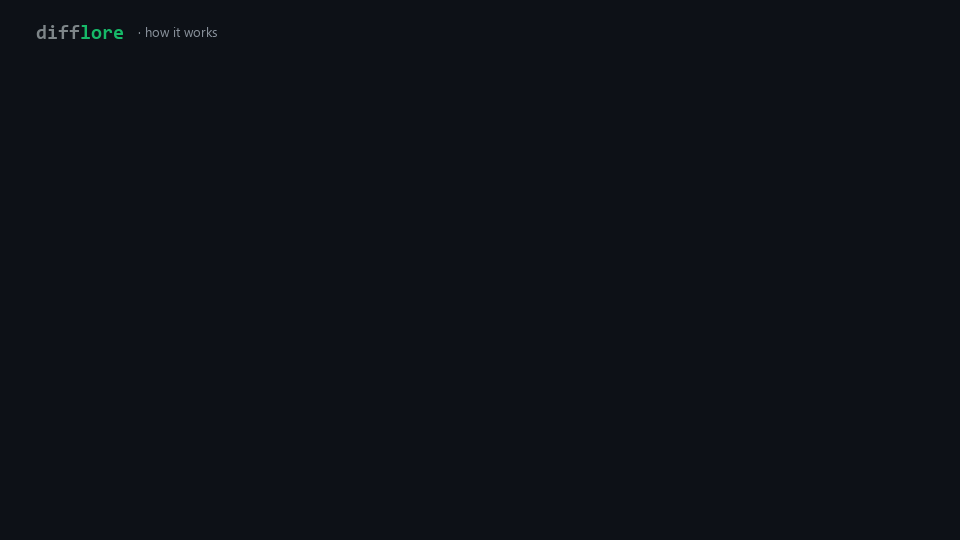

# difflore

[](https://github.com/difflore/difflore-cli/actions)
[](https://crates.io/crates/difflore-cli)
[](LICENSE)
[](https://modelcontextprotocol.io)

DiffLore turns your team's past PR/MR review comments into source-backed rules
your local AI coding agents can recall before they write code.



DiffLore builds a local rule memory from two places — your team's past PR/MR
reviews and your live coding sessions — and keeps you in control of what the
agent sees:

1. **Mine** — import review history, capture rules mid-conversation, and observe
   edits as they happen. Every rule stays traceable to its source.
2. **Review** — new rules arrive as candidates. You approve the real conventions,
   reject the noise, and pause anything that stops being useful.
3. **Serve** — active rules reach your agents over MCP and hooks, right before
   they edit the files that trigger them.

No account required for the local workflow.

## Why

AI coding agents know public code. They do not know the review decisions your
team already made:

- "Use this helper in billing paths."
- "Do not bypass this auth wrapper."
- "This package handles retries; do not add a second loop."
- "This service rejects raw SQL outside migrations."

Those rules are buried in old review threads — exactly where your agent never
looks. DiffLore mines them into local memory, keeps the source evidence
attached, and hands agents the relevant rules before they edit matching code.

## Install

```bash
curl -fsSL https://difflore.dev/install.sh | sh
```

Or with cargo:

```bash
cargo install difflore-cli
```

Update later with `difflore update`.

GitHub import uses your local `git` remote and GitHub CLI auth:

```bash
gh auth login
```

GitLab import uses a stored PAT with `read_api` scope:

```bash
echo "<TOKEN>" | difflore auth gitlab
```

## Quickstart

Fastest look — a bundled demo, no setup:

```bash
difflore try
```

On a real repo:

```bash
cd your-repo
difflore init
difflore import-reviews --dry-run   # see what it would mine, change nothing
difflore import-reviews
difflore memory review              # approve or reject each rule
difflore agents install             # wire into Claude Code / Cursor / Codex / ...
difflore recall --diff              # rules that match your current diff
```

That flow imports merged review history, turns review comments into local memory
candidates, lets you approve or reject them, and wires DiffLore into detected
local agents.

## On a real repo

Pointed at one dogfood workspace, DiffLore mined 237 PRs and 484 human review
comments into 505 source-backed rule candidates — each traceable to the exact
review comment that set it. You approve the real conventions and drop
the rest; DiffLore doesn't decide for you.

Want to see the extraction quality on your own code? See
[Design partners](#design-partners) below.

## Local by default

DiffLore works with private repos and local AI CLIs. A cloud account is not
required.

- Rules and activity live in local SQLite.
- `difflore import-reviews` writes locally unless you explicitly pass `--upload`.
- `difflore cloud login` / `difflore cloud sync` are opt-in; raw local queues
  are never uploaded by default.
- Static exports to `AGENTS.md` / `CLAUDE.md` are optional snapshots. Live
  `agents install` is the preferred path because it is diff-aware.

## Agent support

```bash
difflore agents install
difflore agents status
```

DiffLore installs MCP entries and lifecycle hooks where the local agent supports
them. The installer detects common local coding agents, including Claude Code,
Codex, Cursor, Gemini CLI, Windsurf, Goose, OpenCode, Copilot CLI, Crush, Roo
Code, Warp, and Antigravity.

## Commands

| Command | Purpose |
| --- | --- |
| `difflore try` | Run the demo |
| `difflore init` | Set up the current repo |
| `difflore import-reviews` | Import private GitHub PR or GitLab MR review backlog locally |
| `difflore memory` | Show remembered rules, review queue, paused rules, sync state, and next action |
| `difflore memory review` | Review pending local memory |
| `difflore agents install` | Wire DiffLore into local AI CLIs and agents |
| `difflore agents status` | Show which agents are connected |
| `difflore status` | Show readiness and the next command |
| `difflore recall --diff` | Retrieve matching rules for the current diff |
| `difflore review --diff all` | Review the current diff without modifying files |
| `difflore fix` | Apply rule-aware local fixes |
| `difflore ask "..."` | Ask the team's source-backed rules a question |
| `difflore export` | Write a static snapshot to `AGENTS.md` or `CLAUDE.md` |
| `difflore capabilities --json` | Print the machine-readable CLI/MCP contract |

Run `difflore --help` for the full command list.

## Optional Cloud

The cloud layer is for teams that want hosted GitHub App ingestion, shared team
rules, dashboards, managed semantic recall, governance, and audit workflows.
The local CLI has no hosted PR quota; cloud quotas apply only to managed
GitHub App / team workflows.

```bash
difflore cloud login
difflore cloud status
difflore cloud sync
difflore memory team-candidates
```

Use the local CLI first when you want a no-account path. Use cloud when multiple
people need one shared memory and review workflow.

## Design partners

I'm looking for a handful of teams to judge real output. The deal is simple:
point the CLI at one of your repos (or I run it on a public one you pick), look
at the extracted rules, and tell me which are real conventions and which are
noise. Harsh verdicts are the useful ones. Open an issue, or email me at
hello@difflore.dev.

## Development

```bash
cargo fmt --all --check
cargo check -p difflore-cli
cargo test -p difflore-cli
```

Issues and PRs are welcome. Do not include secrets, private PR text, or private
code in examples.

For suspected vulnerabilities, please follow [SECURITY.md](SECURITY.md) instead
of opening a public issue.

## License

Apache 2.0. See [LICENSE](LICENSE).
