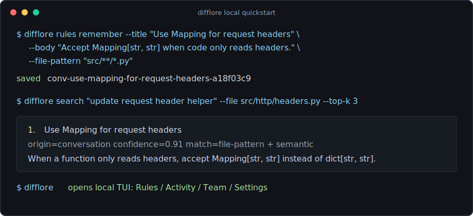

# difflore

[](https://github.com/difflore/difflore-cli/actions)
[](LICENSE)
[](https://modelcontextprotocol.io)

DiffLore is an open-source CLI that turns past GitHub PR review comments into
local memory for AI coding agents.

It imports review feedback your team already wrote, stores the resulting rules
in local SQLite, and serves the relevant ones to agents through MCP, installed
hooks, or the CLI.

```bash
curl --proto '=https' --tlsv1.2 -LsSf \
  https://github.com/difflore/difflore-cli/releases/latest/download/difflore-cli-installer.sh | sh
```

Windows PowerShell:

```powershell
powershell -ExecutionPolicy Bypass -c "irm https://github.com/difflore/difflore-cli/releases/latest/download/difflore-cli-installer.ps1 | iex"
```

Other install paths:

```bash
brew install difflore/tap/difflore
cargo install difflore-cli
cargo install --git https://github.com/difflore/difflore-cli difflore-cli # unreleased main
```

Prerequisites for importing PR reviews: `git` and GitHub CLI `gh`.
Run `gh auth login` once before importing PR reviews.

## Quickstart

Run the bundled demo without touching a repo:

```bash
difflore try
```

Use it in a GitHub repo:

```bash
cd your-repo
difflore init
difflore import-reviews --dry-run
difflore import-reviews
difflore recall --diff
difflore agents install
```

After setup, your agent can ask DiffLore for review memory before it edits a
file. You can also preview or apply rule-aware local fixes:

```bash
difflore fix --preview
```

DiffLore never commits, pushes, opens PRs, or posts GitHub comments.

<p align="center"></p>

## Common Commands

| Command | Purpose |
|---|---|
| `difflore try` | Run the zero-setup demo |
| `difflore init` | Set up DiffLore for the current repo |
| `difflore import-reviews` | Import GitHub PR review history |
| `difflore recall --diff` | Preview memories for the current diff |
| `difflore fix --preview` | Preview rule-aware local fixes |
| `difflore status` | Show local memory health and next steps |
| `difflore agents install` | Wire supported local agents |
| `difflore doctor --report` | Write a diagnostic report |

Run `difflore --help` for the full command list.

## Local First

The default path is one Rust binary plus local SQLite. No cloud account is
needed.

Data leaves your laptop only when you opt in. The local CLI does not require a
cloud account.

- `difflore cloud ...` commands are for optional team workflows.
- `difflore embeddings setup` can use your own OpenAI-compatible embedding key
  for semantic recall.
- `difflore import-reviews --upload` uploads imported review data instead of
  keeping the import local.

If cloud or embeddings are unavailable, local keyword and file-pattern recall
still works.

## Supported Agents

`difflore agents install` can wire DiffLore into supported local agents such as
Claude Code, Cursor, Gemini CLI, Windsurf, and MCP-capable CLIs. Run
`difflore agents status` for the current list on your machine.

## Development

```bash
cargo fmt --all --check
cargo check -p difflore-cli
cargo test -p difflore-cli
```

Merging to `main` does not publish a release. Maintainers publish from a
release commit by bumping crate versions and `CHANGELOG.md`, then pushing a
`vX.Y.Z` tag.

On a release tag, GitHub Actions builds GitHub Release artifacts and publishes
the Homebrew formula. The independent `Publish crates` workflow publishes
crates.io packages in dependency order, or skips versions that are already
published. For the first crates.io release, publish the crates manually once or
temporarily add `CARGO_REGISTRY_TOKEN`; after that, use crates.io Trusted
Publishing and remove long-lived tokens.

Issues and PRs are welcome. Do not include secrets, private PR text, or
private code in examples.

For suspected vulnerabilities, email **hello@difflore.dev** instead of opening
a public issue.

## License

Apache 2.0. See [LICENSE](LICENSE).
