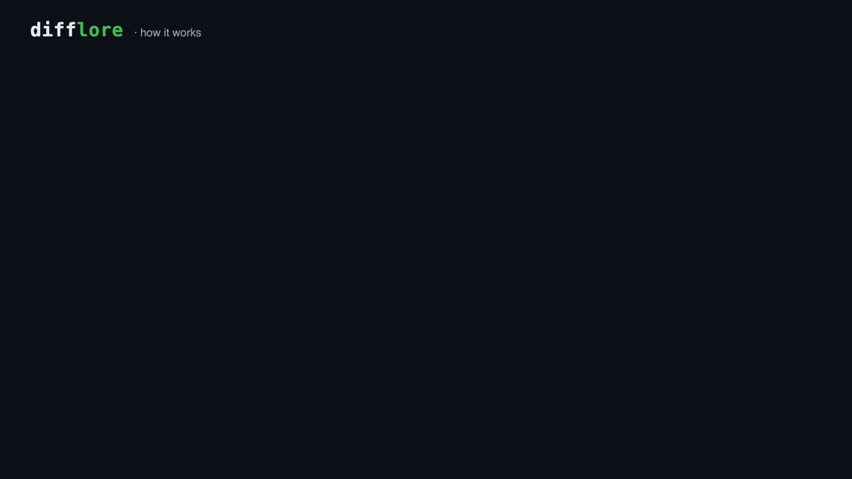

# difflore

[](https://github.com/difflore/difflore-cli/actions)
[](https://crates.io/crates/difflore-cli)
[](LICENSE)
[](https://modelcontextprotocol.io)

Never write the same review comment twice. DiffLore mines the rules your team
already settled in PR/MR review, keeps capturing the corrections you make in
live coding sessions, and hands the approved, source-traceable result to Claude
Code, Codex, Cursor, and other local AI CLIs before they write or review code.
Review engines are free now; your team's judgment isn't.



DiffLore builds a local system of record for your team's rules from two places —
your team's past PR/MR reviews and your live coding sessions — and keeps you in
control of what the agent sees:

1. **Mine** — import review history, capture rules mid-conversation, and observe
   edits as they happen. Every rule stays traceable to its source.
2. **Review** — new rules arrive as candidates. You approve the real conventions,
   reject the noise, and pause anything that stops being useful.
3. **Serve** — active rules reach your agents over MCP and hooks, right before
   they edit the files that trigger them.

No account required for the local workflow.

## Why

AI coding agents know public code. They do not know the review decisions your
team already made:

- "Use this helper in billing paths."
- "Do not bypass this auth wrapper."
- "This package handles retries; do not add a second loop."
- "This service rejects raw SQL outside migrations."

Those rules are buried in old review threads — exactly where your agent never
looks. DiffLore mines them into local rules, keeps the source evidence attached,
and hands agents the relevant rules before they edit matching code.

## Install

```bash
curl -fsSL https://difflore.dev/install.sh | sh
```

Or with cargo:

```bash
cargo install difflore-cli
```

Update later with `difflore update`.

GitHub import uses your local `git` remote and GitHub CLI auth:

```bash
gh auth login
```

GitLab import uses a stored PAT with `read_api` scope:

```bash
echo "<TOKEN>" | difflore auth gitlab
```

## Quickstart

Fastest look — a bundled demo, no setup:

```bash
difflore try
```

On a real repo:

```bash
cd your-repo
difflore init
difflore import-reviews --dry-run   # see what it would mine, change nothing
difflore import-reviews
difflore rules review              # approve or reject each rule
difflore agents install             # wire into Claude Code / Cursor / Codex / ...
difflore recall --diff              # rules that match your current diff
```

That flow imports merged review history, turns review comments into
source-backed rule candidates, lets you approve or reject them, and wires
DiffLore into detected local agents.

## On a real repo

Pointed at one dogfood workspace, DiffLore mined 237 PRs and 484 human review
comments into source-backed rule candidates, each traceable to the exact review
comment that set it. You approve the few real conventions and drop the rest;
DiffLore doesn't decide for you.

Want to see the extraction quality on your own code? See
[Design partners](#design-partners) below.

## Local by default

DiffLore works with private repos and local AI CLIs. A cloud account is not
required.

- Rules and activity live in local SQLite.
- `difflore import-reviews` imports review history and drafts rule candidates
  locally by default.
- `difflore cloud login` / `difflore cloud sync` are opt-in; raw local queues
  are never uploaded by default.
- Static exports to `AGENTS.md` / `CLAUDE.md` are optional snapshots. Live
  `agents install` is the preferred path because it is diff-aware.

## Keys & privacy

DiffLore does not need DiffLore-hosted AI keys for the local-first path.

- Review and mining flows use your installed local agent CLI, such as Claude
  Code or Codex, or an API key you provide in your own shell or CI.
- Semantic search defaults to local keyword matching. Run
  `difflore embeddings setup` only when you want BYOK semantic vectors with
  your own OpenAI-compatible embedding key.
- `difflore embeddings setup --no-key` supports keyless local embedding
  providers, such as Ollama's OpenAI-compatible endpoint.
- The normal `difflore cloud sync` path synchronizes approved rule text and
  metadata. It does not upload source code, diffs, or API keys; raw local
  queues require explicit include flags.

## Run the gate in CI

DiffLore can fail a pull request or merge request with the same local review
gate you run on your machine:

```yaml
- uses: difflore/difflore-cli@main
  with:
    engine: claude
  env:
    ANTHROPIC_API_KEY: ${{ secrets.ANTHROPIC_API_KEY }}
```

See [`examples/github-actions-review.yml`](examples/github-actions-review.yml)
and [`examples/gitlab-ci-review.yml`](examples/gitlab-ci-review.yml) for
copy-pasteable workflows. If you have a shared team rule set, pass
`DIFFLORE_CLOUD_TOKEN` so CI can run `difflore cloud sync --pull`; otherwise
commit static exports such as `CLAUDE.md`, `AGENTS.md`, or `.cursor/rules/*.mdc`.

No GitHub App, no hosted webhooks — the gate runs inside your CI, your code and
LLM keys stay in your infrastructure, and the same model works on GitHub and
GitLab.

## Agent support

```bash
difflore agents install
difflore agents status
```

DiffLore installs MCP entries and lifecycle hooks where the local agent supports
them. The installer detects common local coding agents, including Claude Code,
Codex, Cursor, Gemini CLI, Windsurf, Goose, OpenCode, Copilot CLI, Crush, Roo
Code, Warp, and Antigravity.

## Commands

| Command | Purpose |
| --- | --- |
| `difflore try` | Run the demo |
| `difflore init` | Set up the current repo |
| `difflore import-reviews` | Import private GitHub PR or GitLab MR review backlog locally |
| `difflore rules` | Show active rules, review queue, paused rules, sync state, and next action |
| `difflore rules review` | Review pending local rules |
| `difflore agents install` | Wire DiffLore into local AI CLIs and agents |
| `difflore agents status` | Show which agents are connected |
| `difflore status` | Show readiness and the next command |
| `difflore recall --diff` | Retrieve matching rules for the current diff |
| `difflore review --diff all` | Run your review engine (Claude Code, Codex, ...) on the current diff with team rules loaded; modifies nothing |
| `difflore fix` | Apply rule-aware local fixes |
| `difflore ask "..."` | Ask the team's source-backed rules a question |
| `difflore export` | Write static snapshots to `AGENTS.md`, `CLAUDE.md`, `.cursor/rules/*.mdc`, or `.opencodereview/rule.json` |
| `difflore capabilities --json` | Print the machine-readable CLI/MCP contract |

Run `difflore --help` for the full command list.

## Optional Cloud

The cloud layer is for teams: one shared, approved rule set, an approval
workflow with source provenance, dashboards, and managed semantic recall.
Everything local is free for individuals, forever; paid plans start when the
second person joins. Review import and first-pass distillation stay local; cloud
sync is an explicit opt-in.

```bash
difflore cloud login
difflore cloud status
difflore cloud sync
difflore rules team-candidates
```

Use the local CLI first when you want a no-account path. Use cloud when multiple
people need one shared, approved rule set and review workflow.

## Design partners

I'm looking for a handful of teams to judge real output. The deal is simple:
point the CLI at one of your repos (or I run it on a public one you pick), look
at the extracted rules, and tell me which are real conventions and which are
noise. Harsh verdicts are the useful ones. Open an issue, or email me at
hello@difflore.dev.

## Development

```bash
cargo fmt --all --check
cargo check -p difflore-cli
cargo test -p difflore-cli
```

Issues and PRs are welcome. Do not include secrets, private PR text, or private
code in examples.

For suspected vulnerabilities, please follow [SECURITY.md](SECURITY.md) instead
of opening a public issue.

## License

Apache 2.0. See [LICENSE](LICENSE).
